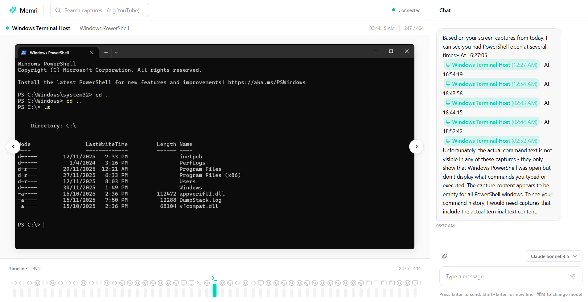
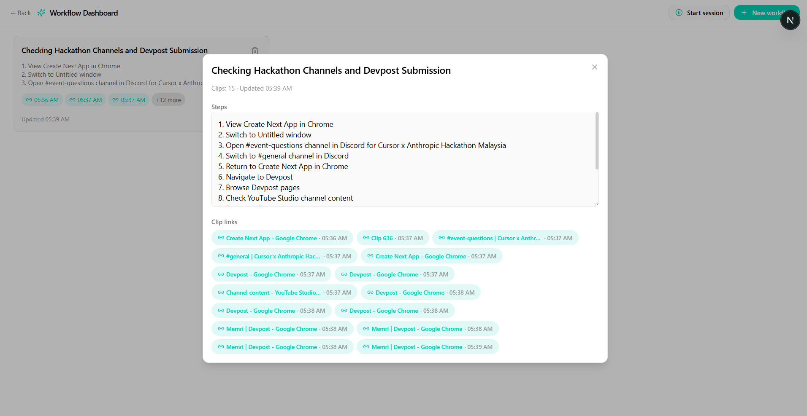

# Memri: Continuous Vision + Chat for the Desktop

Memri watches your screen (with permission), detects meaningful changes, runs on-device OCR, and streams that context into a chat-first UX.

- Backend (`memri-app`, Rust): screen capture, change detection, OCR, SQLite storage, APIs.
- Frontend (`memri-frontend`, Next.js): live timeline of captures, OCR text viewer, and chat UI wired to the backend.
- Local-first: data stays on your machine; SQLite + images on disk.
- Realtime: SSE/WebSockets keep chat and timeline in sync.

## Preview


### Chat with context from captures


### Search OCR text


### Local status & logs


### Creating Workflows for AI Agents


## Features

- **Smart capture loop**: configurable interval and change-detection to avoid noisy frames.
- **OCR everywhere**: Windows-native OCR; text stored alongside images.
- **Contextual chat**: assistant can reference recent captures and OCR snippets.
- **Searchable timeline**: filter by window/app, search OCR text, open detail drawers with metadata.
- **Local persistence**: SQLite DB plus image folder on disk; retention controls.
- **APIs for builders**: REST + realtime stream for captures, OCR, and chat events.

## Run Locally

### Prerequisites
- Windows 10/11
- Rust toolchain (stable)
- Node.js 18+ and npm

### Backend (`memri-app`)
```bash
cd memri-app
cargo run
```

Configuration lives in `memri-app/memri-config.toml`. You can override values with environment variables if you prefer:
- `MEMRI_MONITOR_ID` (default 0)
- `MEMRI_CAPTURE_INTERVAL_MS` / `MEMRI_CAPTURE_MAX_INTERVAL_MS`
- `MEMRI_CAPTURE_UNFOCUSED` (true/false)
- `MEMRI_LANGUAGES` (e.g., `en`)
- `MEMRI_DATABASE_URL` (e.g., `sqlite://./memri.db`)
- `MEMRI_API_ADDR` (default `127.0.0.1:8080`)
- `MEMRI_API_KEY` (optional)
- `ANTHROPIC_API_KEY` (required for assistant; can be set at runtime)

Images are written to `memri-app/captures/`; SQLite lives at `memri.db`.

### Frontend (`memri-frontend`)
```bash
cd memri-frontend
npm install
npm run dev
```

Create `memri-frontend/.env.local`:
```
NEXT_PUBLIC_API_BASE=http://127.0.0.1:8080
```
(Add `ANTHROPIC_API_KEY` here if the frontend calls the backend with a key.)

### Typical Flow
1. Start backend: `cargo run` (captures + API + SSE).
2. Start frontend: `npm run dev` and open http://localhost:3000.
3. Grant screen permissions; watch the timeline and chat fill with context.
